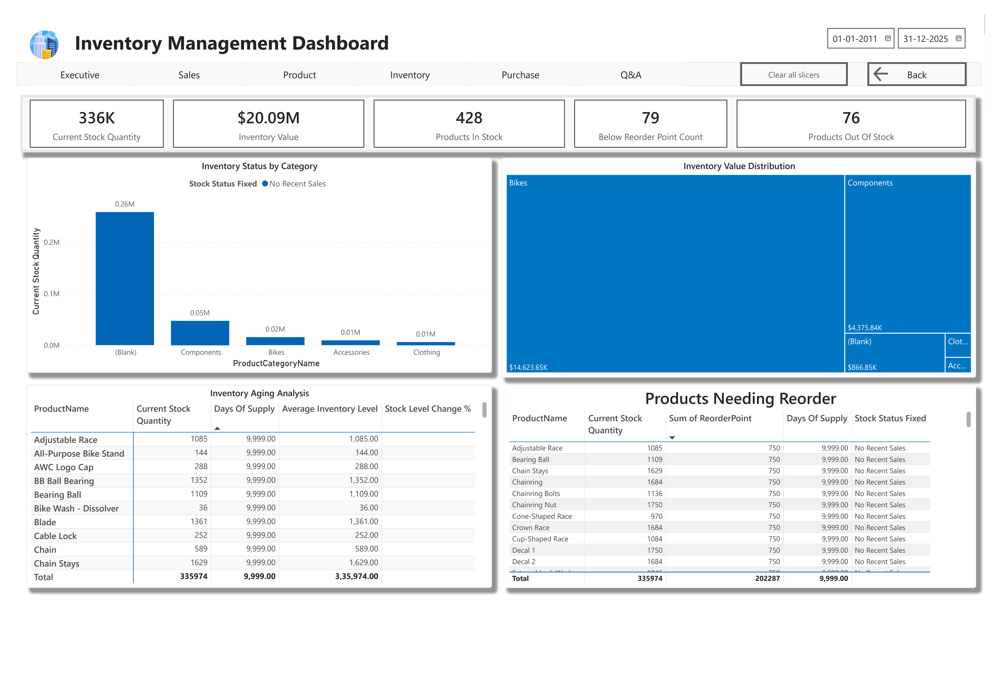

# AdventureWorks Data Analysis Project

## Overview
This project provides analysis of the AdventureWorks database, which represents a fictional bicycle manufacturer's data model. The database includes information about products, sales, purchasing, human resources, and more.

## Data Source
The AdventureWorks2019 dataset was downloaded from the official Microsoft link:
https://learn.microsoft.com/en-us/sql/samples/adventureworks-install-configure

## Repository Contents
- **Data Dictionary**: Comprehensive documentation of database tables and relationships
- **Analysis Scripts**: SQL queries for data exploration and analysis
- **Power BI Reports**: Interactive dashboards and visualizations

## Dashboard Images
- **Executive Dashboard**: 
- **Inventory Dashboard**: 
- **Product Dashboard**: 
- **Sales Dashboard**: 

## Database Schema
The AdventureWorks database is organized into 5 main schemas:
- **HumanResources**: Contains 6 tables related to employees and organizational structure
- **Person**: Contains 13 tables with customer and contact information
- **Production**: Contains 25 tables with products, inventory, and manufacturing data
- **Purchasing**: Contains 5 tables related to vendors and purchase orders
- **Sales**: Contains 19 tables with customer, order, and sales data

## Key Tables and Record Counts
The database contains 71 tables with approximately 675,000 records:
- SalesOrderDetail (121,317 records): Individual line items for sales
- TransactionHistory (113,443 records): Product transaction history
- TransactionHistoryArchive (89,253 records): Archived transaction history
- WorkOrder (72,591 records): Manufacturing work orders
- WorkOrderRouting (67,131 records): Manufacturing steps
- SalesOrderHeader (31,465 records): Sales order headers

## Entity Relationships
The repository includes a detailed mapping of foreign key relationships between tables, which helps in understanding:
- How customers connect to orders
- How products relate to categories and inventory
- How employees connect to departments and sales territories
- How vendors connect to purchase orders

## Getting Started
1. Review the DATA_DICTIONARY.md file to understand database structure
2. Explore the SQL scripts to see analysis examples
3. Open the Power BI reports to interact with the visualizations

## Usage with Power BI
When connecting to this data with Power BI:
- Use the relationships defined in the foreign key relationships file to create your data model
- Consider the row counts when designing queries for performance optimization
- Create hierarchies for dimensions like Product (Category → Subcategory → Product)
- Create date tables to enable time intelligence functions

## Analysis Opportunities
This dataset is ideal for:
- Sales analysis by territory, product, or time period
- Inventory management analysis
- Employee performance evaluation
- Product profitability analysis
- Customer purchasing behavior analysis

## Power BI Features Utilized
- **Data Modeling**: Star schema implementation with proper relationships
- **DAX Measures**: Custom calculations for KPIs and metrics
- **Visual Interactions**: Synchronized filtering across report elements
- **Drill-through**: Detailed analysis capabilities from summary views
- **Power Query**: Data transformation and preparation
